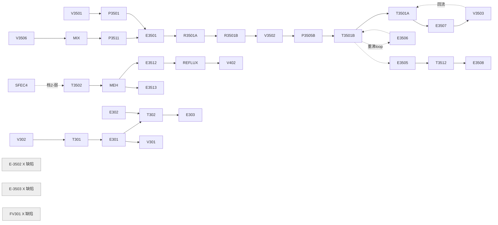

# MTBE 流程快览（Mermaid；实线语义见 SVG 图例）

```mermaid
flowchart LR
  V3506 --> MIX --> P3511 --> E3501 --> R3501A --> R3501B --> V3502 --> P3505B --> T3501B
  V3501 --> P3501 --> E3501
  T3501B --> T3501A --> E3507 --> V3503 -.回流.-> T3501A
  T3501B -.重沸loop.-> E3506 -.-> T3501B
  T3501B -.-> E3505 --> T3512 --> E3508
  SFEC4 -.档2-弱.-> T3502 --> MEH --> E3512 --> REFLUX --> V402
  MEH --> E3513
  V302 --> T301 --> E301 --> T302 --> E303
  E301 --> V301
  E302 --> T302
  classDef defect fill:#eee,stroke:#999
  E3502X[E-3502 X 缺陷]:::defect
  E3503X[E-3503 X 缺陷]:::defect
  FV301X[FV301 X 缺陷]:::defect
```
